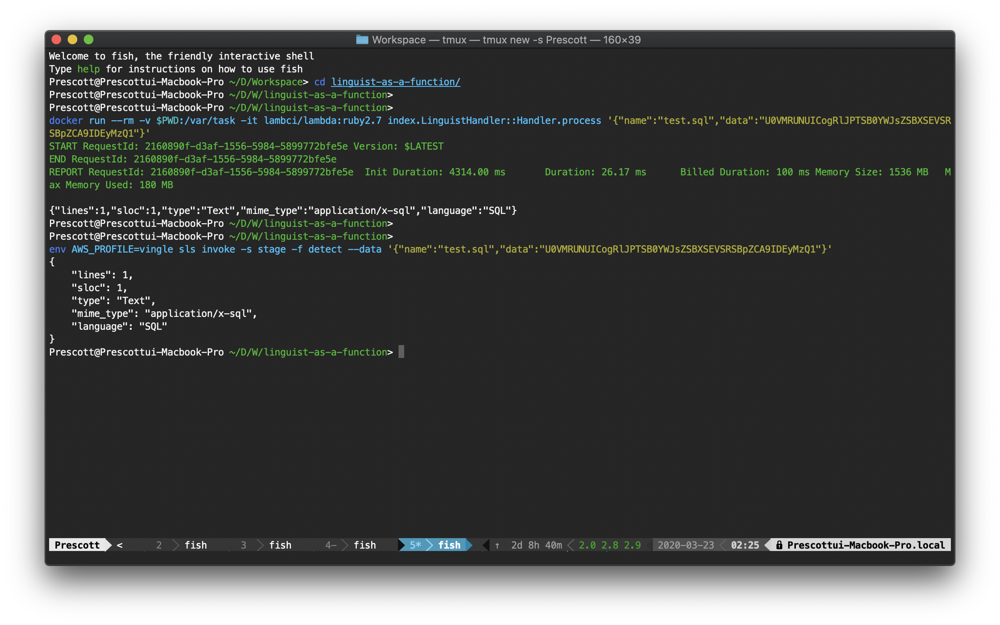

# linguist-as-a-function

[](https://github.com/mooyoul/serverless-latest-layer-version/actions)
[](http://mooyoul.mit-license.org/)

Use [`github/linguist`](https://github.com/github/linguist) as a Lambda Function (or with API Gateway!)



## Functions

Currently, There are two Lambda functions:

### Standalone handler

This function is standalone handler, which is suitable for non API G/W use case.

##### Input

```typescript
interface Input {
  name: string; // required. name of given file.
  data: string; // required. "base64 encoded" data string
}
```

##### Output

```typescript
interface Output {
  lines: number; // 123
  sloc: number; // 98
  type: string; // "Text" | "Image" | "Binary"
  mime_type: string; // "text/plain"
  language: string | null; // "SQL". `null` indicates zero matches
}
```

 
### API Gateway handler

- Method: POST
- Content-Type: application/json

##### Request

```typescript
interface RequestBody {
  name: string; // required. name of given file.
  data: string; // required. "base64 encoded" data string
}
````

##### Response

```typescript
interface ResponseBody {
  data: {
    lines: number; // 123
    sloc: number; // 98
    type: string; // "Text" | "Image" | "Binary"
    mime_type: string; // "text/plain"
    language: string | null; // "SQL". `null` indicates zero matches}
  };
} 
```

> Function failure will response with non 200-OK status.
 

## Getting Started

#### System Requirements

- Docker
- Node.js 10+
- Ruby 2.7.0 with Bundler


```bash
$ git clone https://github.com/mooyoul/linguist.git
$ cd linguist
$ npm ci
$ bundle install
$ npm run pack
$ npm run deploy
```

or refer to [Github Actions workflow](.github/workflows/main.yml) for detailed setup steps. 

## Testing

```bash
$ bundle exec rspec
```

## License
[MIT](LICENSE)

See full license on [mooyoul.mit-license.org](http://mooyoul.mit-license.org/)
